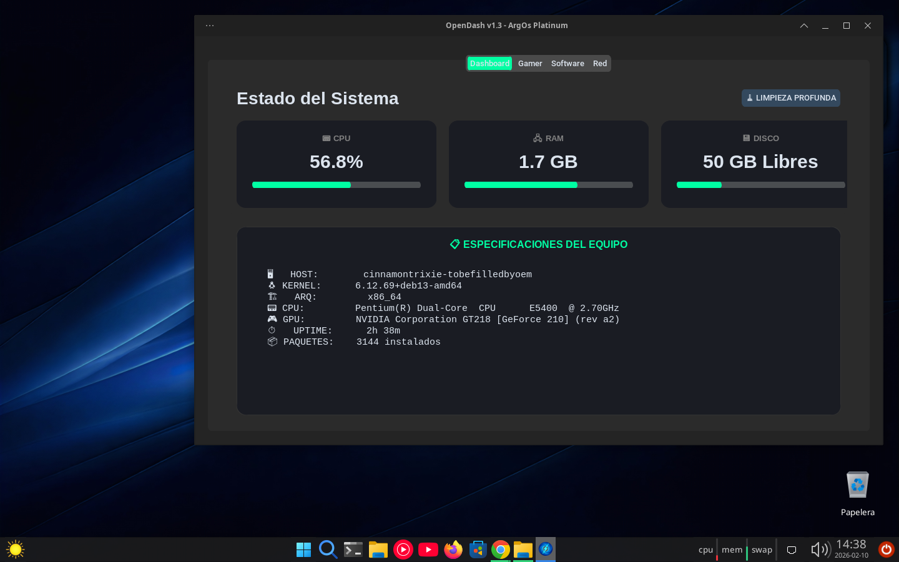
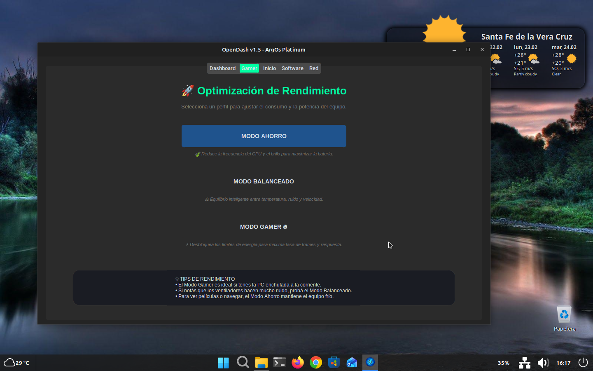
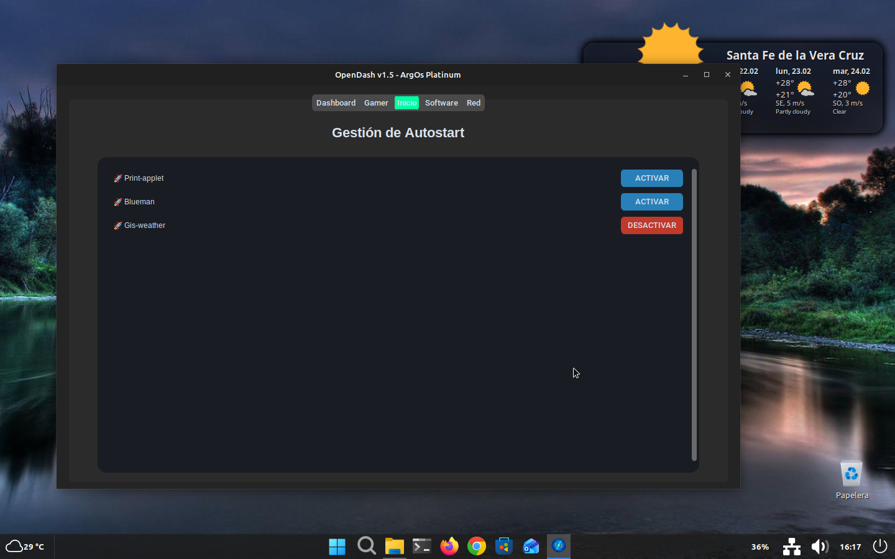
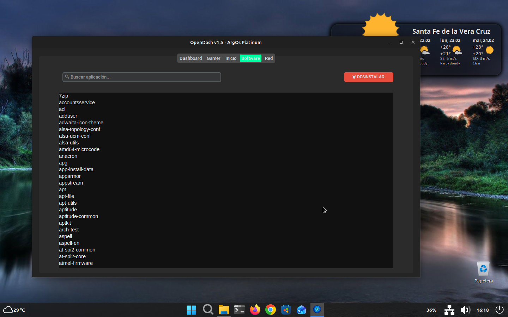
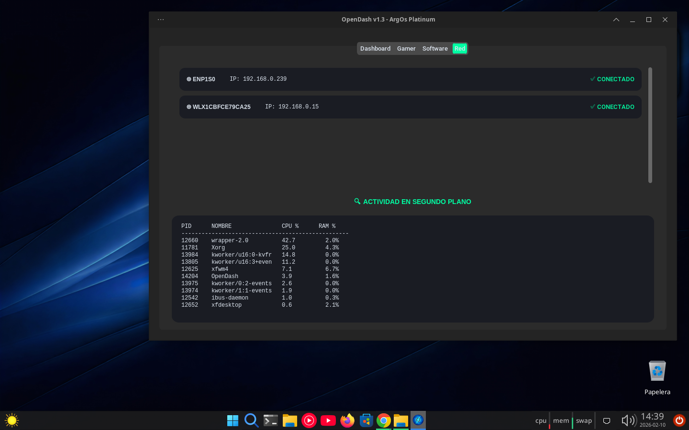

# 🚀 OpenDash v1.5 - ArgOs Platinum Ultra Edition

Centro de control integral para **OpenArgOs**, diseñado para monitoreo de hardware, optimización de energía y mantenimiento del sistema.

## ✨ Novedades de la Versión 1.5 Platinum
- **Dashboard Avanzado:** Información técnica detallada (CPU, GPU, Kernel) con estética profesional.
- **Gamer:** Selector de perfiles para adecuarse a cada pc, tipo de trabajo o para juegos
- **Limpiador Total:** Ahora incluye vaciado de papelera de usuario y limpieza de caché de sistema.
- **Monitor de Red y Procesos:** Visualización en tiempo real de la actividad en segundo plano.
- **Inicio:** Monitor de aplicaciones de inicio automatico, con la opcion de desmarcar y refrescar la info

🛠️ Requisitos:

-Python 3

-CustomTkinter

-Psutil

## 📸 Capturas de Pantalla

### 🖥️ Dashboard (Estado del Sistema)


### 🎮 Modo Gamer (Optimización)


### Inicio (Aplicaciones con inicio automatico)


### Software (Desintalador inteligente)


### 🌐 Red y Procesos


## 📥 Instalación Rápida

Para ejecutar desde el código fuente en Debian Trixie / ArgOs:

```bash
# Instalar dependencias necesarias

sudo apt update
sudo apt install python3-pip python3-psutil python3-tk -y
pip install customtkinter --break-system-packages

# Clonar y ejecutar

git clone [https://github.com/Tavo78ok/opendash.git](https://github.com/Tavo78ok/opendash.git)
cd opendash
python3 opendash.py

## 📦 Paquete .DEB

Puedes encontrar el instalador listo en la sección de Releases o descargar el archivo opendash-pkg.deb de este repositorio e instalarlo con: sudo apt install ./opendash-pkg.deb

## License
This project is licensed under the MIT License.


